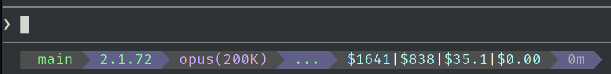

# claude-cost-usage
Rust CLI for reading Claude Code JSONL session files and computing daily/weekly cost summaries.

## Statusline Integration

Power your shell statusline with live Claude spend data. The example below shows `statusline.sh` using `ccu` to display Monthly, Weekly, Today, and Session costs:



```bash
# Example statusline.sh snippet
monthly=$(ccu monthly --json | jq -r '.total_cost')
weekly=$(ccu weekly --json | jq -r '.total_cost')
today=$(ccu today --json | jq -r '.total_cost')
session=$(ccu session --json | jq -r '.total_cost')

echo "Claude: M\$$monthly W\$$weekly D\$$today S\$$session"
```

## Installation

### Quick Install

```bash
curl -fsSL https://raw.githubusercontent.com/scottidler/claude-cost-usage/main/install.sh | bash
```

Options:
```bash
# Install to a custom directory
curl -fsSL https://raw.githubusercontent.com/scottidler/claude-cost-usage/main/install.sh | bash -s -- --to ~/bin

# Install a specific version
curl -fsSL https://raw.githubusercontent.com/scottidler/claude-cost-usage/main/install.sh | bash -s -- --version v0.3.0
```

### From Source

```bash
cargo install --git https://github.com/scottidler/claude-cost-usage
```

## Usage

```bash
# Today's cost
ccu

# Yesterday's cost
ccu yesterday

# Last 7 days
ccu weekly

# Specific date range
ccu --start 2026-03-01 --end 2026-03-11

# JSON output
ccu --json

# Verbose (per-session breakdown)
ccu -v
```

## Version Reporting

The `ccu` binary supports `--version` and `-v` flags:

```
$ ccu --version
ccu v0.3.0
```

- The version is driven by the latest annotated git tag and the output of `git describe`.
- If the current commit is exactly at a tag (e.g., `v0.3.0`), the version will be `ccu v0.3.0`.
- If there are additional commits, it will show something like `ccu v0.3.0-3-gabcdef`.

## Release & Versioning Process

1. **Bump the version in `Cargo.toml`** to the new release version (e.g., `0.4.0`).
2. **Commit** the change.
3. **Tag** the commit with an annotated tag: `git tag -a v0.4.0 -m "Release v0.4.0"`.
4. **Push** the tag: `git push --tags`.
5. **Build** the binary. The version will be embedded from the tag and `git describe`.
6. **Create a GitHub Release** and upload the binary. The version in the binary will match the release tag.

> If the version in `Cargo.toml` does not match the latest tag, a warning will be printed at build time.
